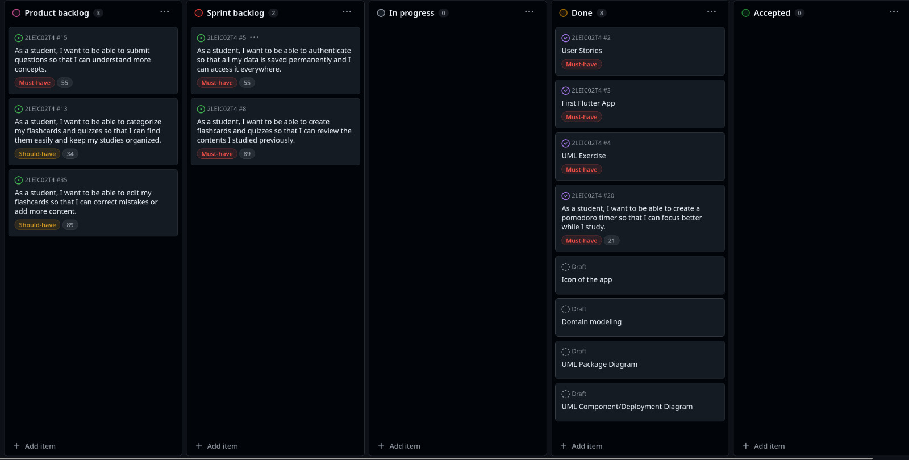

# Focusly Development Report

Welcome to the documentation pages of Focusly!

This Software Development Report, tailored for LEIC-ES-2024-25, provides comprehensive details about Foculy, from high-level vision to low-level implementation decisions. It’s organised by the following activities. 

* [Business modeling](#Business-Modelling) 
  * [Product Vision](#Product-Vision)
  * [Features and Assumptions](#Features-and-Assumptions)
  * [Elevator Pitch](#Elevator-pitch)
* [Requirements](#Requirements)
  * [User stories](#User-stories)
  * [Domain model](#Domain-model)
* [Architecture and Design](#Architecture-And-Design)
  * [Logical architecture](#Logical-Architecture)
  * [Physical architecture](#Physical-Architecture)
  * [Vertical prototype](#Vertical-Prototype)
* [Project management](#Project-Management)
  * [Sprint 0](#Sprint-0)
  * [Sprint 1](#Sprint-1)
  * [Sprint 2](#Sprint-2)
  * [Sprint 3](#Sprint-3)
  * [Sprint 4](#Sprint-4)
  * [Final Release](#Final-Release)

Contributions are expected to be made exclusively by the initial team, but we may open them to the community, after the course, in all areas and topics: requirements, technologies, development, experimentation, testing, etc.

Please contact us!

Thank you!

- Francisca Portugal - [up202303640@up.pt](mailto:up202303640@up.pt)
- Gabriela Silva - [up202304064@up.pt](mailto:up202304064@up.pt)
- Maria Luiza Vieira - [up202304306@up.pt](mailto:up202304306@up.pt)
- Sara García - [up202306877@up.pt](mailto:up202306877@up.pt)

---
## Business Modelling

Business modeling in software development involves defining the product's vision, understanding market needs, aligning features with user expectations, and setting the groundwork for strategic planning and execution.

### Product Vision
<!--
From creating quizzes and flashcards to having a Pomodoro timer, Focusly is an all-in-one study app for an organized and productive study.
-->
Focusly is an all-in-one study app that helps students master topics faster by combining active recall tools (quizzes, flashcards), a collaborative forum, and focus-boosting timers (pomodoro) in one seamless app. Designed for learners of all levels, it turns scattered study methods into a productive, social, and well-organized learning environment.

### Features and Assumptions
- Quizzes & Flashcards – Create, customize, and review quizzes and flashcards to reinforce learning
- Collaborative Forum – Post questions, get answers, and engage in discussions with fellow students
- Pomodoro Timer – Stay focused with an integrated Pomodoro timer for structured study sessions
- Categorization – Organize your flashcards and quizzes by subject or topic for easy access

### Elevator Pitch
Focusly transforms the way you study by combining essential tools into one seamless experience. 
Create personalized quizzes and flashcards, boost focus with a built-in Pomodoro timer, and collaborate with peers through an interactive forum. 

Whether you're preparing for exams or just reviewing concepts, our app makes studying smarter, not harder. Join a community of learners and take your productivity to the next level!
<!-- 
Draft a small text to help you quickly introduce and describe your product in a short time (lift travel time ~90 seconds) and a few words (~800 characters), a technique usually known as elevator pitch.

Take a look at the following links to learn some techniques:
* [Crafting an Elevator Pitch](https://www.mindtools.com/pages/article/elevator-pitch.htm)
* [The Best Elevator Pitch Examples, Templates, and Tactics - A Guide to Writing an Unforgettable Elevator Speech, by strategypeak.com](https://strategypeak.com/elevator-pitch-examples/)
* [Top 7 Killer Elevator Pitch Examples, by toggl.com](https://blog.toggl.com/elevator-pitch-examples/)
-->

## Requirements

### User Stories

- As a student, I want to be able to authenticate so that all my data is saved permanently and I can access it everywhere.
  

**User interface mockups**

  
  
  
  

  

**Acceptance tests**

<h5>Test Case 1: Successful Sign In</h5>

    <em>Given</em> the user is on the Sign In screen, 
    <em>When</em> they enter valid credentials and press "Sign In", 
    <em>Then</em> they should be successfully logged in.

<h5>Test Case 2: Failed Sign In - Incorrect Password</h5>

    <em>Given</em> the user enters an incorrect password, 
    <em>When</em> they try to sign in, 
    <em>Then</em> an error message should be displayed.

<h5>Test Case 3: Successful Sign Up</h5>

    <em>Given</em> the user is on the Sign Up screen, 
    <em>When</em> they enter valid details and press "Sign Up", 
    <em>Then</em> their account should be created, and they should be redirected to the Sign In screen.

<h5>Test Case 4: Failed Sign Up - Username Already Exists</h5>

    <em>Given</em> the user tries to sign up with an already existing username, 
    <em>When</em> they attempt to create an account, 
    <em>Then</em> an error message should be displayed indicating the username is taken.

<h5>Test Case 6: Failed Sign Up - Missing Fields</h5>

    <em>Given</em> the user doesn’t fill in all required fields, 
    <em>When</em> they attempt to sign up, 
    <em>Then</em> an error message should prompt them to complete the form.

 

**Value and effort**

Value: Must-have

Effort: 55

--- 
 

- As a student, I want to be able to submit questions so that I can understand more concepts.  

**User interface mockups**

  
  
  
  

  

**Acceptance tests**
<h5>Test Case 1: Successfully Posting a Question</h5>

    <em>Given</em> the student is on the forum page, 
    <em>When</em> they tap the “+” button and enter a title and description for their question, then press “Publish,” 
    <em>Then</em>  the question should appear in the list of questions in the forum.

<h5>Test Case 2: Attempting to Post a Question Without a Title</h5>

    <em>Given</em> the student is on the forum page, 
    <em>When</em> they try to submit a question without entering a title, 
    <em>Then</em> an error message should be displayed indicating that the title is required.

<h5>Test Case 3: Attempting to Post a Question Without a Description</h5>

    <em>Given</em> the student is on the forum page, 
    <em>When</em> they try to submit a question without entering a description, 
    <em>Then</em> an error message should be displayed indicating that the description is required.

<h5>Test Case 4: Viewing a Posted Question</h5>

    <em>Given</em> the student is on the forum page, 
    <em>When</em> they tap on a question from the list, 
    <em>Then</em> they should be taken to a page displaying the full question along with any answers.

<h5>Test Case 5: Searching for a Question</h5>

    <em>Given</em> the student is on the forum page, 
    <em>When</em> they enter a keyword in the search bar, 
    <em>Then</em> only questions matching the keyword should be displayed in the list.

<h5>Test Case 6: Successfully Posting an Answer</h5>

    <em>Given</em> the student is viewing a question, 
    <em>When</em> they tap the “Post your answer” button, enter their answer, and press “Publish,” 
    <em>Then</em> their answer should appear under the question in the list of answers.

<h5>Test Case 7: Attempting to Post an Empty Answer</h5>

    <em>Given</em> the student is viewing a question, 
    <em>When</em> they tap the “Post your answer” button, enter their answer, and press “Publish,they try to submit an answer without entering any text, 
    <em>Then</em> an error message should be displayed indicating that the answer cannot be empty.

<h5>Test Case 8: Newly Posted Question Appears in the 'New' Section</h5>

    <em>Given</em> the student submits a new question, 
    <em>When</em> they navigate to the "New" section, 
    <em>Then</em> their question should appear at the top of the list, ordered by posting time (most recent first).

<h5>Test Case 9: Student’s Questions Appear in 'My Questions' Section</h5>

    <em>Given</em> the student has posted multiple questions, 
    <em>When</em> they navigate to the "My Questions" section, 
    <em>Then</em> only their questions should be displayed in descending order of posting time

 

**Value and effort**

Value: Must-have

Effort: 55

---
 

- As a student, I want to be able to create a pomodoro timer so that I can focus better while I study.

  

**User interface mockups**

  
  
  

  

**Acceptance tests**
<h5>Test Case 1: Start Pomodoro Timer</h5>

    <em>Given</em> the user is on the Pomodoro timer screen, 
    <em>When</em> the user selects "Pomodoro" mode and clicks the Start button, 
    <em>Then</em> the timer should begin counting down from 25:00.

<h5>Test Case 2: Start Short Break Timer</h5>

    <em>Given</em> the user is on the Pomodoro timer screen, 
    <em>When</em> the user selects "Short Break" mode and clicks the Start button, 
    <em>Then</em> the timer should begin counting down from 5:00.

<h5>Test Case 3: Start Long Break Timer</h5>

    <em>Given</em> the user is on the Pomodoro timer screen, 
    <em>When</em> the user selects "Long Break" mode and clicks the Start button, 
    <em>Then</em> the timer should begin counting down from 15:00.

<h5>Test Case 4: Pause the Timer</h5>

    <em>Given</em> a timer is running, 
    <em>When</em> the user clicks the Pause button, 
    <em>Then</em> the countdown should stop and remain at the current time.

<h5>Test Case 5: Reset the Timer</h5>

    <em>Given</em> a timer is running or paused, 
    <em>When</em> the user clicks the Reset button, 
    <em>Then</em> the timer should reset to the initial value (25:00 for Pomodoro, 5:00 for Short Break, 15:00 for Long Break).

<h5>Test Case 6: Ensure Timer Doesn’t Skip or Freeze</h5>

    <em>Given</em> the timer is running, 
    <em>When</em> the user switches pages in the app, 
    <em>Then</em> the timer should continue running without skipping or freezing.

<h5>Test Case 7: Display Correct Active Mode</h5>

    <em>Given</em> the user switches between different modes (Pomodoro, Short Break, Long Break), 
    <em>When</em> a mode is selected, 
    <em>Then</em> the selected mode should be visually highlighted in the UI.

<h5>Test Case 8: Ensure UI Matches Mockups</h5>

    <em>Given</em> the user opens the app, 
    <em>When</em> the Pomodoro timer screen loads, 
    <em>Then</em> the UI should match the provided mockups in terms of layout, buttons, and colors.

 

**Value and effort**

Value: Must-have

Effort: 21

---
 

- As a student, I want to be able to create flashcards and quizzes so that I can review the contents I studied previously.

  

**User interface mockups**

  
  
  
  

  

  
  
  
  

  

**Acceptance tests**
<h5>Test Case 1: Successfully Creating a Flashcard Deck</h5>

    <em>Given</em> the student is on the "Create" screen, 
    <em>When</em> they select "Flashcards," enter a title and category, add flashcards with front and back content, and press "Done," 
    <em>Then</em> the new flashcard deck should appear under "My Flashcards."

<h5>Test Case 2: Prevent Creating a Flashcard Deck Without a Title</h5>

    <em>Given</em> the student is on the "Create" screen, 
    <em>When</em> they attempt to create a flashcard deck without entering a title, 
    <em>Then</em> an error message should be displayed indicating that a title is required.

<h5>Test Case 3: Successfully Creating a Quiz</h5>

    <em>Given</em> the student is on the "Create" screen, 
    <em>When</em> they select "Quiz," enter a title and category, add questions with multiple-choice options, select correct answers, and press "Done," 
    <em>Then</em> the new quiz should appear under "My Quizzes."

<h5>Test Case 4: Prevent Creating a Quiz Without a Title</h5>

    <em>Given</em> the student is on the "Create" screen, 
    <em>When</em> they attempt to create a quiz without entering a title, 
    <em>Then</em> an error message should be displayed indicating that a title is required.

<h5>Test Case 5: Viewing a Flashcard Deck</h5>

    <em>Given</em> the student has created a flashcard deck, 
    <em>When</em> they select the deck from the "Flashcards" section, 
    <em>Then</em> they should see flashcards one at a time, with options to navigate forward and backward.

<h5>Test Case 6: Taking a Quiz</h5>

    <em>Given</em> the student has created a quiz, 
    <em>When</em> they select the quiz from the "Quizzes" section and submit their answers, 
    <em>Then</em> they should receive feedback on their score.

<h5>Test Case 7: Displaying Continue Learning Section</h5>

    <em>Given</em> the student has previously accessed flashcards or quizzes, 
    <em>When</em> they navigate to the Home screen, 
    <em>Then</em> the "Continue Learning" section should display the most recently accessed flashcards and quizzes.

<h5>Test Case 8: Displaying Available Quizzes</h5>

    <em>Given</em> the student has created or has access to quizzes, 
    <em>When</em> they navigate to the Home screen, 
    <em>Then</em> the "Quizzes" section should list all available quizzes.

<h5>Test Case 9: Displaying Available Flashcard Decks</h5>

    <em>Given</em> the student has created or has access to flashcard decks, 
    <em>When</em> they navigate to the Home screen, 
    <em>Then</em> the "Flashcards" section should list all available flashcard decks.

<h5>Test Case 10: Accessing a Flashcard Deck from Home</h5>

    <em>Given</em> the student is on the Home screen, 
    <em>When</em> they click on a flashcard deck, 
    <em>Then</em> they should be taken to the flashcard review screen.

<h5>Test Case 11: Accessing a Quiz from Home</h5>

    <em>Given</em> the student is on the Home screen, 
    <em>When</em> they click on a quiz, 
    <em>Then</em> they should be taken to the quiz-taking screen.

<h5>Test Case 12: Home Screen Updates After Creating Flashcards or Quizzes</h5>

    <em>Given</em> the student creates a new flashcard deck or quiz, 
    <em>When</em> they return to the Home screen, 
    <em>Then</em> the new flashcard deck or quiz should be displayed in the respective section.

 

**Value and effort**

Value: Must-have

Effort: 89

---
 

- As a student, I want to be able to categorize my flashcards and quizzes so that I can find them easily and keep my studies organized.

  

**User interface mockups**

  
  
  

  

**Acceptance tests**
<h5>Test Case 1: Creating a New Category</h5>

    <em>Given</em> the student is on the Profile screen, 
    <em>When</em> they click the "Add Category" button, 
    <em>Then</em> a modal should appear allowing them to enter a category title, select an icon, and choose a color. 
    <em>And</em> after clicking "Add," the new category should be displayed in the "Your Categories" section.

<h5>Test Case 2: Viewing Flashcards and Quizzes by Category</h5>

    <em>Given</em> the student has categorized flashcards and quizzes, 
    <em>When</em> they select a category from the Profile screen, 
    <em>Then</em> they should see a list of all flashcards and quizzes associated with that category.

<h5>Test Case 3: Preventing Duplicate Category Names</h5>

    <em>Given</em> the student tries to create a category, 
    <em>When</em> they enter a name that already exists, 
    <em>Then</em> an error message should be displayed preventing duplicate categories.

<h5>Test Case 4: Visual Differentiation of Categories</h5>

    <em>Given</em> the student has multiple categories, 
    <em>When</em> they view the Profile screen, 
    <em>Then</em> each category should be displayed with its chosen color and icon for easy recognition.

 

**Value and effort**

Value: Should-have

Effort: 34

---
 

- As a student, I want to be able to edit my flashcards and quizzes so that I can correct mistakes or add more content.

  

**User interface mockups**

  
  

  

**Acceptance tests**
<h5>Test Case 1: Editing a Flashcard Deck Title</h5>

    <em>Given</em> the student is on the "Edit Flashcard Deck" screen, 
    <em>When</em> they click the pencil icon next to the title, 
    <em>Then</em> they should be able to modify the deck's title, 
    <em>And</em> the updated title should be saved and displayed after clicking "done."

<h5>Test Case 2: Editing a Flashcard</h5>

    <em>Given</em> the student is on the "Edit Flashcard Deck" screen, 
    <em>When</em> they click the pencil icon on a flashcard, 
    <em>Then</em> they should be able to modify both the front and back text of the flashcard, 
    <em>And</em> the changes should be saved and displayed after clicking "done."

<h5>Test Case 3: Deleting a Flashcard</h5>

    <em>Given</em> the student is on the "Edit Flashcard Deck" screen, 
    <em>When</em> they click the trash bin icon on a flashcard, 
    <em>Then</em> the flashcard should be removed from the deck, 
    <em>And</em> the change should persist after clicking "done."

<h5>Test Case 4: Adding a Flashcard</h5>

    <em>Given</em> the student is on the "Edit Flashcard Deck" screen, 
    <em>When</em> they click the "+" button, 
    <em>Then</em> a new blank flashcard should appear for input, 
    <em>And</em> after entering the front and back text, it should be added to the deck upon saving.

<h5>Test Case 5: Editing a Quiz Title</h5>

    <em>Given</em> the student is on the "Edit Quiz" screen, 
    <em>When</em> they click the pencil icon next to the quiz title, 
    <em>Then</em> they should be able to modify the title, 
    <em>And</em> the updated title should be saved after clicking "done."

<h5>Test Case 6: Editing a Quiz Question</h5>

    <em>Given</em> the student is on the "Edit Quiz" screen, 
    <em>When</em> they click the pencil icon on a question, 
    <em>Then</em> they should be able to edit the question text and its options, 
    <em>And</em> the changes should be saved and displayed after clicking "done."

<h5>Test Case 7: Deleting a Quiz Question</h5>

    <em>Given</em> the student is on the "Edit Quiz" screen, 
    <em>When</em> they click the trash bin icon on a question, 
    <em>Then</em> the question should be removed from the quiz, 
    <em>And</em> the change should persist after clicking "done."

<h5>Test Case 8: Adding a New Quiz Question</h5>

    <em>Given</em> the student is on the "Edit Quiz" screen, 
    <em>When</em> they click the "+" button, 
    <em>Then</em> a new blank question should appear for input, 
    <em>And</em> after entering the question and its options, it should be added to the quiz upon saving.

<h5>Test Case 9: Category Updates Reflect in Edits</h5>

    <em>Given</em> the student is editing a flashcard deck or quiz, 
    <em>When</em> they modify the category, 
    <em>Then</em> the deck or quiz should be moved to the new category, 
    <em>And</em> the change should be reflected on the home and profile screens.

 

**Value and effort**

Value: Should-have

Effort: 89

<!-- 
**User interface mockups**.
After the user story text, you should add a draft of the corresponding user interfaces, a simple mockup or draft, if applicable.

**Acceptance tests**.
For each user story you should write also the acceptance tests (textually in [Gherkin](https://cucumber.io/docs/gherkin/reference/)), i.e., a description of scenarios (situations) that will help to confirm that the system satisfies the requirements addressed by the user story.

**Value and effort**.
At the end, it is good to add a rough indication of the value of the user story to the customers (e.g. [MoSCoW](https://en.wikipedia.org/wiki/MoSCoW_method) method) and the team should add an estimation of the effort to implement it, for example, using points in a kind-of-a Fibonnacci scale (1,2,3,5,8,13,20,40, no idea).

-->
---

### Domain model

## Architecture and Design
<!--
The architecture of a software system encompasses the set of key decisions about its organization. 

A well written architecture document is brief and reduces the amount of time it takes new programmers to a project to understand the code to feel able to make modifications and enhancements.

To document the architecture requires describing the decomposition of the system in their parts (high-level components) and the key behaviors and collaborations between them. 

In this section you should start by briefly describing the components of the project and their interrelations. You should describe how you solved typical problems you may have encountered, pointing to well-known architectural and design patterns, if applicable.
-->

### Logical architecture

### Physical architecture

### Vertical prototype
<!--
To help on validating all the architectural, design and technological decisions made, we usually implement a vertical prototype, a thin vertical slice of the system integrating as much technologies we can.

In this subsection please describe which feature, or part of it, you have implemented, and how, together with a snapshot of the user interface, if applicable.

At this phase, instead of a complete user story, you can simply implement a small part of a feature that demonstrates thay you can use the technology, for example, show a screen with the app credits (name and authors).
-->
For the vertical prototype, we expanded the implementation to include additional core features beyond the Pomodoro Timer, ensuring seamless integration and functionality across the app.

Implemented Features
- **Pomodoro Timer** (Sprint 0)
    - Users can switch between Pomodoro (25-minute), Short Break (5-minute), and Long Break (15-minute) modes.

    - Start, pause, and reset functionality with sound alerts and push notifications.

    - UI consistency with mockups and active mode highlighting.

- **User Authentication** (Sprint 1 & 2)

    - Sign in with Google and Sign Out functionality.

    - Email & password authentication (Create Account & Sign In pages).

    - Secure user data storage and retrieval.

- **Quiz and Flashcard System** (Sprint 1)

    - Creation of quizzes and flashcard decks, linked to the database.

    - Visualization of quizzes and flashcards for review.

- **Quiz and Flashcard Editing** (Sprint 2)

    - Modification of existing flashcards and quizzes via a dedicated edit page.

    - Edit section in the Create page to view and select flashcards/quizzes for editing.

    - Separate edit pages for modifying content after selection.

- **Forum Feature** (Sprint 2)

    - Users can post questions and answer existing ones.

    - Search functionality to browse through questions.
  

**UI Snapshot**

Sprint 0:

    

    

---
Sprint 1:

  
  
  

 

---
Sprint 2:

  
  

 

  
  
  

 

  
  
  
  

  

---
Sprint 3:

  
  
  

  
  
  
  

## Project management
<!--
Software project management is the art and science of planning and leading software projects, in which software projects are planned, implemented, monitored and controlled.

In the context of ESOF, we recommend each team to adopt a set of project management practices and tools capable of registering tasks, assigning tasks to team members, adding estimations to tasks, monitor tasks progress, and therefore being able to track their projects.

Common practices of managing agile software development with Scrum are: backlog management, release management, estimation, Sprint planning, Sprint development, acceptance tests, and Sprint retrospectives.

You can find below information and references related with the project management: 

* Backlog management: Product backlog and Sprint backlog in a [Github Projects board](https://github.com/orgs/FEUP-LEIC-ES-2023-24/projects/64);
* Release management: [v0](#), v1, v2, v3, ...;
* Sprint planning and retrospectives: 
  * plans: screenshots of Github Projects board at begin and end of each Sprint;
  * retrospectives: meeting notes in a document in the repository, addressing the following questions:
    * Did well: things we did well and should continue;
    * Do differently: things we should do differently and how;
    * Puzzles: things we don’t know yet if they are right or wrong… 
    * list of a few improvements to implement next Sprint;

-->

### Sprint 0

**Beginning**

**End**

**Did well**: Great task division, team work efficiency and good communication

**Do differently**: Have a higher effort value in a single sprint

**Puzzles**: None

Improvements to implement next Sprint:
- Do at least two user stories to maximize efficiency
- Handle documentation early on

### Sprint 1

**Beginning**

**End**

**Did well**: Successfully implemented core features within the sprint timeline, good communication

**Do differently**: Do the acceptance tests foreach feature immediately after its implementation is complete

**Puzzles**: Integrating the authentication system was trickier than expected

Improvements to implement next Sprint:
- Study better the topic we are about to implement so that we can divide the tasks more appropriately

**happiness meters**

<table border="1" cellspacing="0" cellpadding="10">
  <tr>
    <th></th>
    <th>Francisca</th>
    <th>Gabriela</th>
    <th>Maria Luiza</th>
    <th>Sara</th>
  </tr>
  <tr>
    <th>Francisca</th>
    <td>⭐ Excellent</td>
    <td>⭐ Excellent</td>
    <td>⭐ Excellent</td>
    <td>⭐ Excellent</td>
  </tr>
  <tr>
    <th>Gabriela</th>
    <td>⭐ Excellent</td>
    <td>⭐ Excellent</td>
    <td>⭐ Excellent</td>
    <td>⭐ Excellent</td>
  </tr>
  <tr>
    <th>Maria Luiza</th>
    <td>⭐ Excellent</td>
    <td>⭐ Excellent</td>
    <td>⭐ Excellent</td>
    <td>⭐ Excellent</td>
  </tr>
  <tr>
    <th>Sara</th>
    <td>⭐ Excellent</td>
    <td>⭐ Excellent</td>
    <td>⭐ Excellent</td>
    <td>⭐ Excellent</td>
  </tr>
</table>

_Each row in the table corresponds to an individual's evaluations, with the person's name indicating the evaluator and the subsequent cells detailing their assessments of each peer._

### Sprint 2
**Beginning**

**End**

**Did well**: Good collaboration and task division among team members, which helped deliver both major features on time

**Do differently**: Plan more time for backend/database integration when introducing new features

**Puzzles**: Deciding how to structure forum posts and replies in the database took longer than expected

Improvements to implement next Sprint:
- Plan more effectively to avoid last-minute work on the final day

**happiness meters**

<table border="1" cellspacing="0" cellpadding="10">
  <tr>
    <th></th>
    <th>Francisca</th>
    <th>Gabriela</th>
    <th>Maria Luiza</th>
    <th>Sara</th>
  </tr>
  <tr>
    <th>Francisca</th>
    <td>⭐ Excellent</td>
    <td>⭐ Excellent</td>
    <td>⭐ Excellent</td>
    <td>⭐ Excellent</td>
  </tr>
  <tr>
    <th>Gabriela</th>
    <td>⭐ Excellent</td>
    <td>⭐ Excellent</td>
    <td>⭐ Excellent</td>
    <td>⭐ Excellent</td>
  </tr>
  <tr>
    <th>Maria Luiza</th>
    <td>⭐ Excellent</td>
    <td>⭐ Excellent</td>
    <td>⭐ Excellent</td>
    <td>⭐ Excellent</td>
  </tr>
  <tr>
    <th>Sara</th>
    <td>⭐ Excellent</td>
    <td>⭐ Excellent</td>
    <td>⭐ Excellent</td>
    <td>⭐ Excellent</td>
  </tr>
</table>

_Each row in the table corresponds to an individual's evaluations, with the person's name indicating the evaluator and the subsequent cells detailing their assessments of each peer._

### Sprint 3
**Beginning**

**End**

**Did well**: Strong teamwork and clear task division enabled on-time delivery of major features.

**Do differently**: Prioritize documentation updates concurrently with feature development

**Puzzles**: Color adaptation for dark mode

Improvements to implement next Sprint: 
- Define the tasks to be done before work allocation

**happiness meters**

<table border="1" cellspacing="0" cellpadding="10">
  <tr>
    <th></th>
    <th>Francisca</th>
    <th>Gabriela</th>
    <th>Maria Luiza</th>
    <th>Sara</th>
  </tr>
  <tr>
    <th>Francisca</th>
    <td>⭐ Excellent</td>
    <td>⭐ Excellent</td>
    <td>⭐ Excellent</td>
    <td>⭐ Excellent</td>
  </tr>
  <tr>
    <th>Gabriela</th>
    <td>⭐ Excellent</td>
    <td>⭐ Excellent</td>
    <td>⭐ Excellent</td>
    <td>⭐ Excellent</td>
  </tr>
  <tr>
    <th>Maria Luiza</th>
    <td>⭐ Excellent</td>
    <td>⭐ Excellent</td>
    <td>⭐ Excellent</td>
    <td>⭐ Excellent</td>
  </tr>
  <tr>
    <th>Sara</th>
    <td>⭐ Excellent</td>
    <td>⭐ Excellent</td>
    <td>⭐ Excellent</td>
    <td>⭐ Excellent</td>
  </tr>
</table>

_Each row in the table corresponds to an individual's evaluations, with the person's name indicating the evaluator and the subsequent cells detailing their assessments of each peer._

### Final Release
-> Fixed minor bugs

**Did well**: Successfully polished the application with thorough bug fixing and quality assurance, ensuring a stable and reliable product for release.

**Do differently**: Implement more comprehensive automated testing earlier in development to catch edge case bugs before the final release phase.

**happiness meters**

<table border="1" cellspacing="0" cellpadding="10">
  <tr>
    <th></th>
    <th>Francisca</th>
    <th>Gabriela</th>
    <th>Maria Luiza</th>
    <th>Sara</th>
  </tr>
  <tr>
    <th>Francisca</th>
    <td>⭐ Excellent</td>
    <td>⭐ Excellent</td>
    <td>⭐ Excellent</td>
    <td>⭐ Excellent</td>
  </tr>
  <tr>
    <th>Gabriela</th>
    <td>⭐ Excellent</td>
    <td>⭐ Excellent</td>
    <td>⭐ Excellent</td>
    <td>⭐ Excellent</td>
  </tr>
  <tr>
    <th>Maria Luiza</th>
    <td>⭐ Excellent</td>
    <td>⭐ Excellent</td>
    <td>⭐ Excellent</td>
    <td>⭐ Excellent</td>
  </tr>
  <tr>
    <th>Sara</th>
    <td>⭐ Excellent</td>
    <td>⭐ Excellent</td>
    <td>⭐ Excellent</td>
    <td>⭐ Excellent</td>
  </tr>
</table>

_Each row in the table corresponds to an individual's evaluations, with the person's name indicating the evaluator and the subsequent cells detailing their assessments of each peer._

